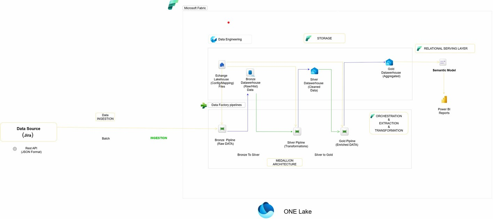

# Microsoft-Fabric-Pipelines-JIRA
## 📌 Description
Ce projet met en place un pipeline complet sous **Microsoft Fabric** pour :
- **Extraire** les données depuis **JIRA** via son API REST.
- **Ingest** dans une base de données centralisée.
- **Transformer** et organiser les données selon l’**architecture Medallion** (Bronze → Silver → Gold).
- **Modéliser** et **analyser** les données dans un **Data Warehouse**.
- **Visualiser** les résultats dans **Power BI**.

Les données manipulées concernent **trois ensembles principaux** :
- `backlogs`
- `issues`
- `components`

---

## 🛠️ Technologies utilisées
- **Microsoft Fabric** – Pipelines, Data Warehouse et orchestration
- **OneLake** – Stockage des données
- **Power BI** – Tableaux de bord interactifs
- **API REST JIRA** – Extraction des données brutes
- **Pipelines** – Nettoyage, modélisation et transformations
- **Architecture Medallion** – Bronze, Silver, Gold

---
## 🏗 Architecture générale

  

Le pipeline est basé sur **Microsoft Fabric Data Pipelines** et est totalement paramétrable pour différents ensembles de données.
## ⚙️ Workflow du projet

1. **Extraction**  
   - Connexion à l’**API REST JIRA** pour récupérer les données `backlogs`, `issues` et `components`.
   - Export des données brutes au format JSON.

2. **Ingestion (Bronze)**  
   - Chargement des données brutes dans une **base de données** via **pipelines Microsoft Fabric**.
   - Stockage en tables brutes sans transformation.

3. **Transformation Silver**  
   - Création d’un **Data Warehouse Silver** avec des données nettoyées et structurées.
   - Application de règles métiers simples (formatage, suppression doublons, typage des colonnes).
   - Les données sont essentiellement **copiées et nettoyées** dans ce Data Warehouse.

4. **Transformation Gold**  
   - Création d’un **Data Warehouse Gold** optimisé pour l’analyse.
   - Mise en place du **schéma en étoile** avec :
     - Tables **de faits** (mesures, métriques clés).
     - Tables **de dimensions** (dates, projets, utilisateurs, composants).
   - Enrichissement des données pour répondre aux besoins analytiques.

5. **Visualisation**  
   - Création de rapports interactifs dans **Power BI** connectés au Data Warehouse Gold.

---

## 📂 Organisation du projet
