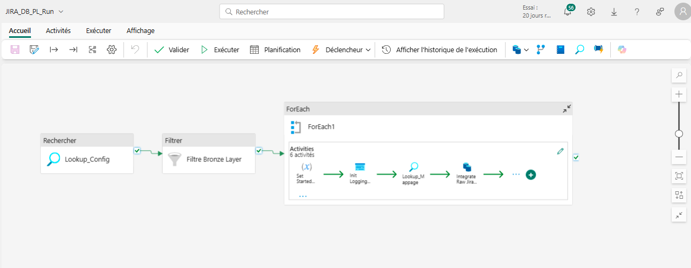

## 📋 Objectif
La **couche Bronze** contient les **données brutes** extraites depuis l’API REST de JIRA, sans transformation majeure, afin de préserver l’intégrité des données sources.

---

## 📤 Sources de données
- **API REST JIRA** :
  - Extraction des données via endpoints `/rest/api/2/issue`, `/rest/api/2/component`, `/rest/api/2/backlog`
  - Authentification par clé API
  - Récupération au format JSON

---
## ⚙️ Processus d’ingestion
  
1. **Appel API**  
   - Utilisation d’un pipeline Fabric / Data Factory pour consommer l’API REST  
   - Pagination et gestion des limites de requêtes

2. **Stockage dans Fabric SQL**  
   - Base de données : `JIRA_DB_BD_Dev_Bronze`  
   - Tables cibles :   
     - `issues`  
     - `components`

3. **Log d’exécution**  
   - Enregistrement de l’heure de début et fin  
   - Stockage des statuts `Succeeded` / `Failed`

4. **Historisation**  
   - Conservation des anciennes versions des enregistrements  
   - Ajout de colonnes techniques :  
     - `ValidFrom` (date d’entrée en vigueur de la ligne)  
     - `ValidTo` (date de fin de validité)  
     - `IsCurrent` (indique si l’enregistrement est la version active)  
   - Permet de retracer les évolutions des données dans le temps
